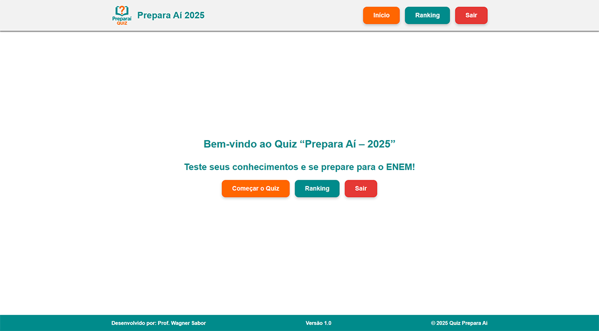
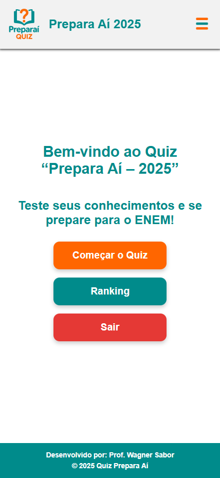

# Quiz Prepara Aí – 2025 🚀

Bem-vindo ao repositório do **Quiz Prepara Aí – 2025**! Uma plataforma interativa de quiz focada em ajudar estudantes a testarem seus conhecimentos e se prepararem para o ENEM e outros vestibulares.

[](https://preparai2025.vercel.app)
[](https://preparai2025-backend.vercel.app)

<!-- Adicione mais badges se desejar, ex: Licença, Versão -->

#### Preparaí 2025 - Desktop



#### Preparaí 2025 - Mobile



## 📝 Sobre o Projeto

O "Prepara Aí – 2025" é uma aplicação web full-stack desenvolvida para oferecer uma experiência de aprendizado dinâmica e divertida. Os usuários podem realizar quizzes com perguntas de múltipla escolha, acompanhar seu desempenho e competir de forma saudável no ranking geral.

## ✨ Funcionalidades Principais

- **Quiz Interativo:** Perguntas de múltipla escolha com feedback imediato.
- **Contagem de Pontos:** Sistema de pontuação baseado nos acertos.
- **Ranking de Jogadores:** Exibição dos melhores jogadores.
- **Design Responsivo:** Adaptado para uma boa experiência em desktops, tablets e celulares.
- **Autenticação de Usuários:** Login e Cadastro com E-mail/Senha e Google.

## 🛠️ Tecnologias Utilizadas

Este projeto foi construído utilizando as seguintes tecnologias:

**Frontend:**

- **React (com Vite):** Biblioteca JavaScript para construção de interfaces de usuário.
- **React Router DOM:** Para gerenciamento de rotas na aplicação single-page.
- **Axios:** Cliente HTTP para realizar requisições à API.
- **Firebase SDK (Client):** Para autenticação de usuários.
- **CSS Puro / Módulos CSS:** Para estilização dos componentes.

**Backend:**

- **Node.js:** Ambiente de execução JavaScript server-side.
- **Express.js:** Framework web para Node.js, utilizado para construir a API RESTful.
- **Firebase Admin SDK:** Para interação com o Firebase (Firestore) no lado do servidor.
- **Firestore (Firebase):** Banco de dados NoSQL para armazenar perguntas e scores.

**Autenticação:**

- **Firebase Authentication:** Gerencia o login com E-mail/Senha e Google.

**Plataforma de Deploy:**

- **Vercel:** Para deploy contínuo do frontend e backend (como Serverless Functions).

## 🚀 Acessando a Aplicação

Você pode acessar a versão online da aplicação através dos seguintes links:

- **Aplicação Frontend:** [https://preparai2025.vercel.app/](https://preparai2025.vercel.app/)
- **API Backend (Exemplo de endpoint):** [https://preparai2025-backend.vercel.app/perguntas](https://preparai2025-backend.vercel.app/perguntas)

## 🔧 Configuração do Ambiente de Desenvolvimento (Local)

Para rodar este projeto localmente, você precisará de dois terminais/consoles, um para o frontend e outro para o backend.

**Pré-requisitos:**

- [Node.js](https://nodejs.org/)
- [npm](https://www.npmjs.com/) / [yarn](https://yarnpkg.com/) / [pnpm](https://pnpm.io/) (gerenciador de pacotes)
- Uma conta no [Firebase](https://firebase.google.com/) e um projeto criado com:
  - Firebase Authentication (E-mail/Senha e Google habilitados)
  - Firestore Database

**1. Clone os Repositórios:**

```bash
# Clone do repositório
git https://github.com/wsabor/preparai2025

# Primeira instância do terminal - Repositório Frontend
cd frontend

# Segunda instância do terminal - Repositório Backend
cd backend
```

**2. Configuração do Backend:**

- Navegue até a pasta do backend.
- Instale as dependências:
  ```bash
  npm install
  # ou yarn install / pnpm install
  ```
- Crie um arquivo `.env` na raiz do backend e adicione as variáveis de ambiente necessárias.

  ```bash
  PORT=3000
  HOST=0.0.0.0
  ```

- Coloque seu arquivo `firebase-key.json` (baixado do console do Firebase) na raiz do projeto backend. **Lembre-se de NUNCA comitar este arquivo no Git.**
- Inicie o servidor backend:
  ```bash
  npm run dev
  # ou node server.js (dependendo do seu script)
  ```
  O backend estará rodando em (geralmente) `http://localhost:3000`.

**3. Configuração do Frontend:**

- Navegue até a pasta do frontend.
- Instale as dependências:
  ```bash
  npm install
  # ou yarn install / pnpm install
  ```
- Crie um arquivo `.env.development` (ou `.env.development.local`) na raiz do frontend e adicione as variáveis de ambiente:

  ```env
  # frontend/.env.development
  VITE_API_BASE_URL=http://localhost:3000/api # URL do seu backend local

  VITE_FIREBASE_API_KEY=SUA_CHAVE_DE_API_DO_FIREBASE
  VITE_FIREBASE_AUTH_DOMAIN=SEU_AUTH_DOMAIN
  VITE_FIREBASE_PROJECT_ID=SEU_PROJECT_ID
  VITE_FIREBASE_STORAGE_BUCKET=SEU_STORAGE_BUCKET
  VITE_FIREBASE_MESSAGING_SENDER_ID=SEU_MESSAGING_SENDER_ID
  VITE_FIREBASE_APP_ID=SEU_APP_ID
  ```

- (Obtenha as chaves `VITE_FIREBASE_` do seu projeto Firebase -> Configurações do Projeto -> Seus apps -> App da Web -> Configuração do SDK)

- Inicie o servidor de desenvolvimento do frontend:
  ```bash
  npm run dev
  # ou yarn dev / pnpm dev
  ```
  O frontend estará rodando em (geralmente) `http://localhost:5173`.

## 🎨 Estrutura do Projeto

```
# Frontend (ex: pasta frontend/)
src/
├── components/     # Componentes reutilizáveis (Header, Footer, etc.)
├── hooks/          # Hooks customizados (ex: useAuth)
├── pages/          # Componentes de página (Home, Login, Quiz, etc.)
├── services/       # Lógica de chamada de API (quizService)
├── styles/         # Arquivos CSS globais ou por componente
├── App.jsx         # Componente raiz e configuração de rotas
├── firebaseConfig.js # Configuração do Firebase SDK (cliente)
└── main.jsx        # Ponto de entrada da aplicação React

# Backend (ex: pasta backend/)
api/
└── index.js        # Ponto de entrada para Serverless Functions na Vercel
controllers/        # Lógica de negócio (PerguntasController, ScoresController)
routes/             # Definição das rotas da API (perguntas.js, scores.js)
package.json
server.js           # (Opcional, para desenvolvimento local do servidor tradicional)
firebase-key.json   # (Localmente, ignorado pelo Git)
```

## 🤝 Contribuições

Contribuições são bem-vindas! Se você tem sugestões de melhorias, novas funcionalidades ou encontrou algum bug, sinta-se à vontade para:

1.  Fazer um Fork do projeto.
2.  Criar uma Branch para sua Feature (`git checkout -b feature/MinhaFeature`).
3.  Commitar suas mudanças (`git commit -m 'Adiciona MinhaFeature'`).
4.  Fazer Push para a Branch (`git push origin feature/MinhaFeature`).
5.  Abrir um Pull Request.

## 📜 Licença

Este projeto está sob a licença [NOME_DA_LICENCA]. Veja o arquivo `LICENSE` para mais detalhes.
_(Ex: MIT License - se você não tem um arquivo LICENSE, considere adicionar um. O MIT é popular e permissivo)._

## 📧 Contato

Prof. Wagner Sabor - [wsabor.senai@gmail.com](mailto:wsabor.senai@gmail.com) | [GitHub](https://github.com/wsabor) | [LinkedIn](https://www.linkedin.com/in/wsabor/)

Projeto Link: [github.com/wsabor/preparai2025](https://github.com/wsabor/preparai2025)
